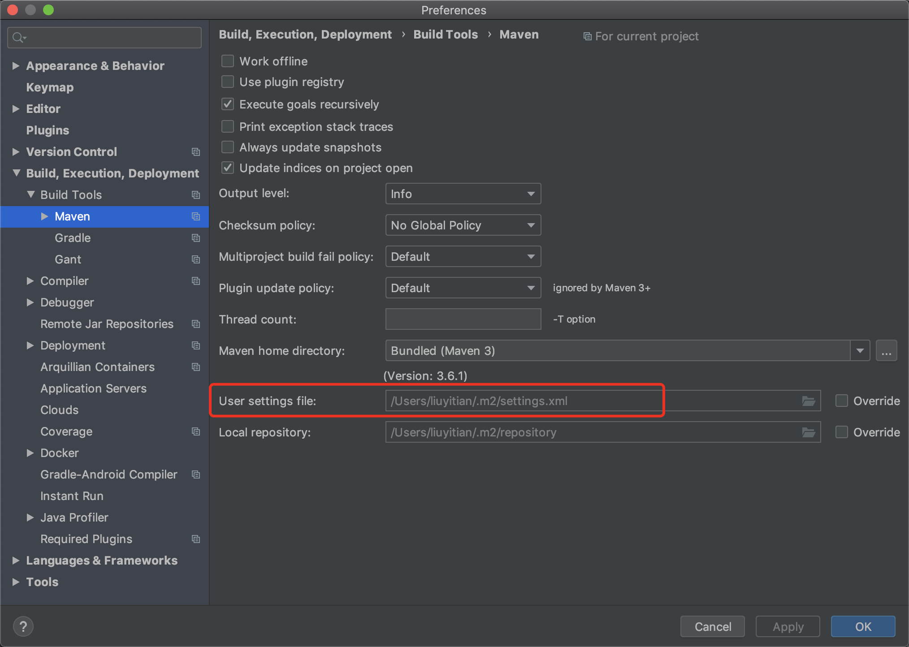
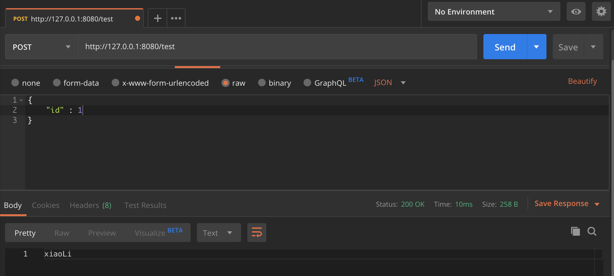

先配置IDEA的maven仓库地址，用于在线自动下载包，默认的地址可能很慢



在设置里找到这个maven的配置文件地址，找到然后修改这个文件

找到<mirrors>

在<mirrors> </mirrors>中间插这么一段儿 保存

```xml
<mirror>  
      <id>alimaven</id>  
      <name>aliyun maven</name>  
      <url>http://maven.aliyun.com/nexus/content/groups/public/</url>  
      <mirrorOf>central</mirrorOf>          
</mirror>
```


mysql的连接配置在 resources -> application.properties

url里TestDataBase是我的数据库名字      username和password


使用的时候在model里建一个java文件，定义一个class与数据库表结构对应

在dao里写类似于sql的语句，注意@Mapper这样的注释

在service里调用dao，注意@Service和@Autowired

在controller里写路由和接入， @CrossOrigin跨域 @Controller，

@RequestMapping定义请求，


更复杂的用法可以参考 https://github.com/jeager12138/Sunflower-Cup-Competition-Reporting-System


运行之后用postman或者其他工具发起post请求



